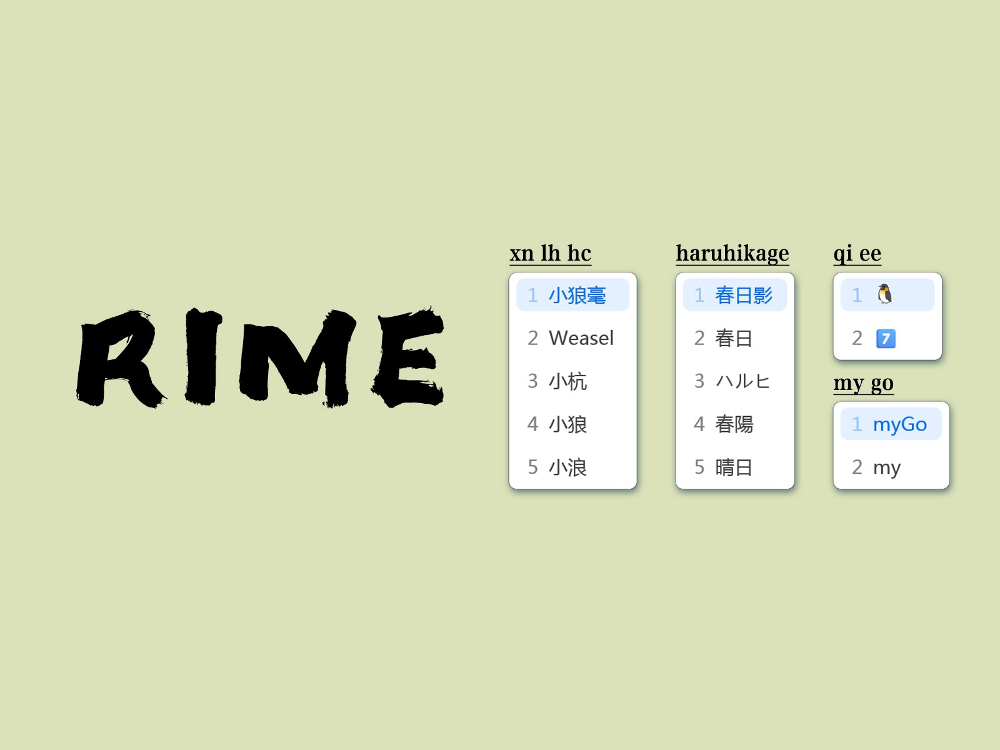

# Rime



本配置方案基于 [万象系列方案](https://github.com/amzxyz/rime_wanxiang_pro) 修改

小鹤双拼+鹤形辅助+英日输入

## 使用配置

- 自定义词库：在根目录新建 `custom_phrase.txt` 文件
- 语法模型：在根目录下载 [wanxiang-lts-zh-hans.gram](https://github.com/amzxyz/RIME-LMDG/releases/download/LTS/wanxiang-lts-zh-hans.gram) 文件
<!-- - 翻译、大模型：复制[simplehttp.dll](https://github.com/hchunhui/librime-cloud)，配置 `lua/config.lua` 中 -->


## 特性

- 打词时插入鹤形作辅助码 ✎ eg. 寄宿 `jisub` 极速 `jimsu`
- 单字辅助码增强(结尾添加o或/) ✎ eg. 森面 `sfmm` vs. 森 `sfmm/` / `sfmmo`
- 在双拼输入末尾键入 `;` 激活[整句辅助](https://github.com/HowcanoeWang/rime-lua-aux-code)模式，键入 `'` 激活单字辅助模式
- 更多的 emoji 🤗, 融合 [Emojiall](https://www.emojiall.com/zh-hans), [繪文字rime-emoji](https://github.com/rime/rime-emoji) 与 [Emoji与符号滤镜](https://github.com/rtransformation/rime-opencc_emoji_symbols/tree/master)
- 优化英文输入体验，取自[雾凇拼音](https://dvel.me/posts/make-rime-en-better/)
- 好看的皮肤 [win11_preset](https://github.com/LufsX/rime)
- 万象语言模型、万象原子词库
<!-- - 末尾键入 `''t` 调用 DeepLX 翻译，键入 `''l` 调用大模型问答，键入 `''i` 调用文生图 -->

### 前缀触发

- 反查: `ab` 前缀进行笔画输入 ✎ eg. 木 `abhspn`
- 反查: `az` 前缀进行[部首](https://github.com/mirtlecn/rime-radical-pinyin)输入 ✎ eg. 晶 `azririri`
- 临时输入: `ae` 前缀临时输入emoji ✎ eg. 🐧 `aeqiee`
- 临时输入: `aw` 前缀临时输入[英文](https://github.com/tumuyan/rime-melt) ✎ eg. myGo `awmygo`
- 临时输入: `aj` 前缀临时输入[日文](https://github.com/gkovacs/rime-japanese) ✎ eg. 春日影 `ajharuhikage` 
- 临时输入: `ap` 前缀临时输入全拼 ✎ eg. 炸梦我去 `apzhamengwoqu`
- 农历输入: `N` 开头 ✎ eg. 二〇二四年四月初八 `N20240515`
- 大写数字: `R` 开头 ✎ eg. 拾壹萬肆仟伍佰壹拾肆 `R114514`
- Unicode输入: `U` 开头 ✎ eg. ⿻ `U2ffb`
- [计算器模式](https://github.com/gaboolic/rime-shuangpin-fuzhuma/blob/main/md/calc.md): `V` 开头 ✎ eg. 1+1=2 `V1+1`，`Vrandom()`

### 关键词触发

- 日期时间相关：`date` `time` `week` `weeknum` `datetime` `timestamp` `lunar` `solarterm` `holiday` `day`
- 输入统计相关：`stats`
- 生成 UUID：`uuid`
- o开头快速输入各种符号偏旁部件 [小鹤 · 符号](https://flypy.cc/#/fh)
- 小鹤直通车[功能实现](https://github.com/kchen0x/rime-crane)，见 [shortcut](./lua/xhup/shortcut_translator.lua)

### 功能键

- ``` ` ``` 万能键 ✎ eg. 鹤 ```he`n```
- `Tab` 循环切换音节: 当输入多个字词时想要给前面补充辅助码，可以多次按下tab循环切换
- `\` 超级简拼：1码、2码、3码时，按下 `\` 自动上屏1字、2字词、3字词，不和空格上屏的单字冲突
- `/` 开头符号输入 ，`/help` 查看帮助，另支持[常用 Latex 符号](https://github.com/wklchris/Rime-latex-symbols) 
- `'` 快符： 通过单引号键引导的26字母快速符号自动上屏，双击''重复上一个符号
- `;` 快符： 双击;;重复上屏汉字和字母
- `Shift + Del` 可以删除错误词频 
- `Shift + ⌫` 可以删除单个汉字的拼音
<!-- - `Control+y` 云输入功能：百度输入法联想，取自[librime-cloud](https://github.com/hchunhui/librime-cloud) -->

## 按键绑定

- 方案选单：`Control+Shift+space` （原始的 Control+grave 与 vscode 打开终端冲突）
- 选词翻页: `- =` / `[ ]` / `Control + hjkl` (vim 风格)
- Opencc开关: 
  - `ctrl+1` emoji 开关；
  - `ctrl+2` 简繁开关；
  - `ctrl+3` 中英互译开关
  - `ctrl+4` 声调开关
  - `ctrl+5` 辅助码开关

## 文件说明

- flypy_flypy: 小鹤双拼+鹤形辅助
- emojis: ae 输入 emoji
- japanese: aj 输入日语 (japanese)
- melt_eng: aw 输入英语 (word)
- pinyin_simp: ap 输入全拼 (pinyin)
- radical_pinyin: az 部首组字