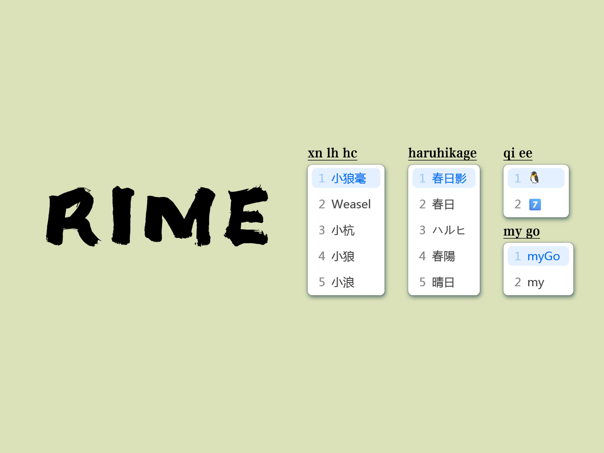

# Rime



本配置方案基于 [墨奇音形](https://github.com/gaboolic/rime-shuangpin-fuzhuma) 修改

小鹤双拼+鹤形辅助+英日输入

## 特性

- 打词时插入鹤形作辅助码 ✎ eg. 寄宿 `jisub` 极速 `jimsu`
- `ab` 开头笔画输入（反查） ✎ eg. 木 `abhspn`
- `az` 开头[组字](https://github.com/mirtlecn/rime-radical-pinyin)输入（反查） ✎ eg. 晶 `azririri`
- `ae` 开头 emoji 输入，`E` 开头输入 emoji 总类 ✎ eg. 🐧 `aeqiee` 🐱 `Edswu`; `ctrl+1` emoji 开关
- `aw` 开头[英文输入](https://github.com/tumuyan/rime-melt) ✎ eg. myGo `awmygo`; `ctrl+3` 中英互译开关
- `aj` 开头[日文输入](https://github.com/gkovacs/rime-japanese) ✎ eg. 春日影 `ajharuhikage` 
- `ap` 开头临时[全拼](https://github.com/iDvel/rime-ice) ✎ eg. 炸梦我去 `apzhamengwoqu`
- N开头农历输入 ✎ eg. 二〇二四年四月初八 `N20240515`
- R开头大写数字 ✎ eg. 拾壹萬肆仟伍佰壹拾肆 `R114514`
- U开头Unicode输入 ✎ eg. ⿻ `U2ffb`
- V开头[计算器模式 ](https://github.com/gaboolic/rime-shuangpin-fuzhuma/blob/main/md/calc.md) ✎ eg. 1+1=2 `V1+1`，`Vrandom()`
- o开头快速输入各种符号偏旁部件 [小鹤 · 符号](https://flypy.cc/#/fh)
- 日期时间相关：`date` `time` `week` `datetime` `timestamp` `lunar` `month`
- 生成 UUID：`uuid`
- 符号输入 `/` 开头，`/help` 查看帮助，另支持[常用 Latex 符号](https://github.com/wklchris/Rime-latex-symbols) 
- 优化英文输入体验，取自[雾凇拼音](https://dvel.me/posts/make-rime-en-better/)
- 好看的皮肤 [win11_preset](https://github.com/LufsX/rime)
- 部分小鹤直通车[功能实现](https://github.com/kchen0x/rime-crane)，见 [shortcut](./lua/xhup/shortcut_translator.lua)
- 云输入功能：复制[simplehttp.dll](https://github.com/hchunhui/librime-cloud)，在输入状态下按 `Control+t` 触发云输入
- 超级简拼：1码、2码、3码时，按下 Tab 自动上屏1字、2字词、3字词，不和空格上屏的单字冲突

## 按键绑定

- 方案选单：`Control+Shift+space` （原始的 Control+grave 与 vscode 打开终端冲突）
- `;` 引导辅助码，`'` 分隔拼音，``` ` ``` 万能键
- Opencc开关: `ctrl+1` emoji 开关；`ctrl+2` 简繁开关；`ctrl+3` 中英互译开关
- 选词翻页: `- =` / `[ ]` / `Control + hjkl` (vim 风格)
- `Shift + Del` 可以删除错误词频 
- `Shift + ⌫` 可以删除单个汉字的拼音
- 自定义词库在根目录新建 `custom_phrase.txt` 文件

```
# Rime table
# coding: utf-8
#
# 请将该文件以UTF-8编码保存为
# Rime用户文件夹/custom_phrase.txt
#
# 码表各字段以制表符（Tab）分隔
# 顺序为：文字、编码、权重（决定重码的次序、可选）
#
# 虽然文本码表编辑较为方便，但不适合导入大量条目

榆井希实	yujkxiui
```

## 文件说明

- flypy_flypy: 小鹤双拼+鹤形辅助
- emoji: ae 输入 emoji
- japanese: aj 输入日语 (japanese)
- melt_eng: aw 输入英语 (word)
- pinyin_simp: ap 输入全拼 (pinyin)
- radical_flypy: az 部首组字